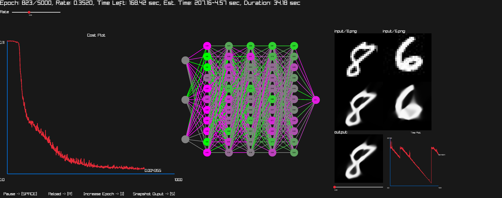

# NN - A Nural Network Framework

NN is meticulously crafted C-based framework offers a concise yet powerful foundation for neural network development. Designed for versatility and clarity, it equips users with essential tools for matrix operations, forward propagation, cost analysis, and gradient-based learning. Ideal for both educational exploration and small-scale neural network experimentation.

## Reference
* Tsoding: https://youtu.be/o7da9anmnMs?list=PLpM-Dvs8t0VZPZKggcql-MmjaBdZKeDMw

## Neural Network Visualization
